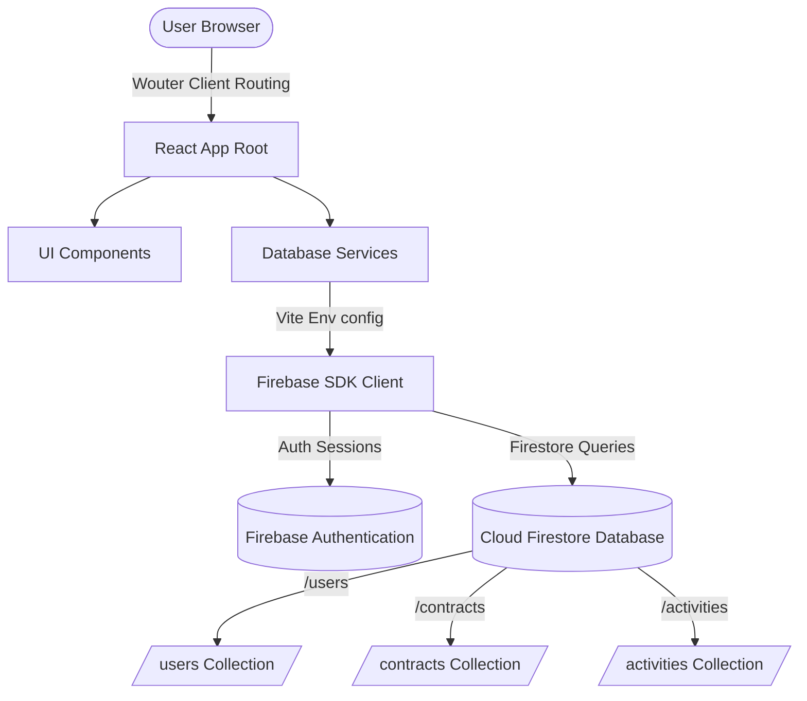

# Review 2 Evaluation & Demo Flow

This document details the project overview, database architecture, security structures, and demonstration flow for the **Oxygen Sports Academy Annual Contract Renewal Tracker** Review 2.

---

## 1. Project Overview & Problem Statement

Oxygen Sports manages hundreds of annual contracts with various sports academies nationwide, providing sports apparel, training gear, and equipment. Previously, tracking contract expiration dates, assigning relationship managers, sending reminders, and initiating renegotiations were handled manually through spreadsheets. This caused operational inefficiencies, missed deadlines, and delayed renewals.

The **Academy Annual Contract Renewal Tracker** provides a centralized, secure database that tracks contracts, monitors expiry dates, triggers real-time visual alerts, and assigns relationship managers to coordinate renegotiations before contracts expire.

---

## 2. System Architecture

The application is built using a modern, serverless single-page app (SPA) architecture:

* **Frontend View Layer:** React 19 (TypeScript) compiled using Vite.
* **Component Styling:** Tailwind CSS and Radix UI primitives.
* **Client Routing:** Wouter.
* **Backend Database & Authentication:** Google Firebase (Cloud Firestore & Authentication).
* **Production Hosting:** Vercel.



---

## 3. Firebase Database Design

### `/users/{uid}` Collection
Stores employee profiles and access permission roles:
```json
{
  "employeeId": "RM001",
  "name": "Priya Sharma",
  "email": "priya@oxygensports.in",
  "role": "relationship_manager", // admin | relationship_manager
  "department": "Cricket Sales",
  "avatar": "PS",
  "status": "active", // active | inactive
  "mustChangePassword": false,
  "createdAt": "2026-06-15T07:40:00Z"
}
```

### `/contracts/{contractId}` Collection
Stores equipment supply contracts:
```json
{
  "academyName": "Elite Cricket Academy",
  "academyType": "Cricket Academy",
  "contactPerson": "Rahul Dravid",
  "phone": "+91 9876543210",
  "email": "info@elitecricket.in",
  "address": "123 Stadium Road",
  "city": "Bangalore",
  "state": "Karnataka",
  "contractStartDate": "2026-01-15",
  "contractEndDate": "2027-01-14",
  "durationMonths": 12,
  "status": "Active", // Active | Expiring Soon | Renewed | Archived
  "equipmentCategories": ["Cricket Equipment", "Sports Apparel"],
  "quantity": 500,
  "supplyFrequency": "Monthly",
  "relationshipManagerId": "RM001",
  "relationshipManagerName": "Priya Sharma",
  "department": "Cricket Sales",
  "contractValue": 1450000,
  "notes": "VIP Client. Needs premium willow bats.",
  "workflowStage": "active", // active | negotiation | reminder_sent | expired
  "createdAt": "Timestamp",
  "updatedAt": "Timestamp"
}
```

### `/activities/{activityId}` Collection
Stores activity logs for auditing updates and status shifts:
```json
{
  "type": "contract_created", // contract_created | status_changed | price_updated | contract_renewed
  "description": "Contract for Elite Cricket Academy created by Priya Sharma.",
  "actor": "Priya Sharma",
  "contractId": "OXY-2026-001",
  "contractName": "Elite Cricket Academy",
  "timestamp": "Timestamp"
}
```

---

## 4. User Roles & Permissions

* **Administrator:**
  * Complete system dashboard access (views all metrics and user counts).
  * Full CRUD access on all contracts.
  * Create, update, and toggle status (activate/deactivate) of Relationship Managers.
  * View aggregate reports and alerts for all managers.
* **Relationship Manager (RM):**
  * Portfolio-restricted access. RMs only view contracts, alerts, and reports assigned to their `employeeId`.
  * Cannot access **User Management** or **Settings**.
  * Can create contracts (system automatically assigns to themselves).
  * Can update status and log activities on their own contracts only.

---

## 5. Expiry Tracking Rules

Contract health status is calculated dynamically relative to the current date based on the following margins:

| Threshold | Margin | Status Display | Visual Color |
|:---|:---|:---|:---|
| **Healthy** | 90+ days remaining | `Healthy` | Green Badge |
| **Attention Required** | 30–90 days remaining | `Attention Required` | Yellow Badge |
| **High Risk** | 7–30 days remaining | `High Risk` | Orange Badge |
| **Critical** | Less than 7 days remaining | `Critical` | Red Badge |
| **Expired** | Past end date (days < 0) | `Expired` | Slate/Gray Badge |

---

## 6. Review 2 Demo Flow Sequence

1. **Admin Logs In:** Log in using the administrator account (`admin@oxygensports.in`).
2. **Create Relationship Manager:** Open **User Management**, add a new Relationship Manager, setting their department, email, and a temporary password.
3. **Create Contract:** Navigate to **Contracts > Add Contract**, fill in the academy details, select equipment categories, duration, and contract value.
4. **Assign Contract:** Select the newly created RM in the Relationship Manager assignment field and submit.
5. **Verify Real-time Update:** Confirm the dashboard metrics update instantly (Total Contracts, active counts, and RM counts reflect the new entries).
6. **RM Logs In:** Log out as Admin and log in with the new RM credentials.
7. **Verify Portfolio Boundaries:** Confirm the RM *only* sees the assigned contract, and accessing the `/users` or `/settings` path directly in the URL triggers the `Unauthorized` page.
8. **Test Status and Expiry Action:** Open the assigned contract, update its status, log logistics notes, and verify the activity timeline reflects the changes.

---

## 7. Development Roadmap

### Completed Modules (Review 2)
* **Serverless Client React Architecture:** Completed the transition from a nested Replit folder structure directly to a clean single-package project.
* **Firebase Identity & Auth Integration:** Standardized login, session persistence, routing guards, and automatic redirects.
* **Role-Based Row Security:** Configured secure Firebase rules and verified standard user constraints.
* **Real-time Synchronization:** Configured hooks to dynamically stream updates directly from Cloud Firestore.
* **Responsive Styling & Empty States:** Cleaned all CSS structures, aligned HSL palettes, and styled exact empty states.

### Remaining Modules (Review 3)
* **Automated Expiry Scheduler:** Implementing a serverless cron job/cloud function to periodically update contract statuses in Firestore.
* **Direct Client CSV Export:** Complete local file streaming for contract summaries and expired lists.
* **Audit PDF Generator:** Adding support to download print-ready contract worksheets.
* **Interactive Client Timeline Comments:** Add a feature for RMs to leave comments directly on contract timelines.
